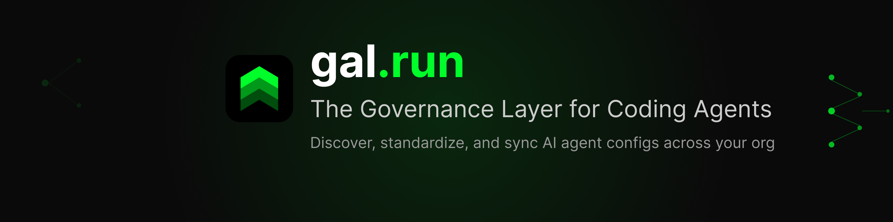

<p align="center">
  
</p>

<p align="center">
  <a href="https://github.com/Scheduler-Systems/gal-run/issues"></a>
  <a href="https://gal.run"></a>
</p>

# GAL - Governance Agentic Layer

The easiest way to govern your AI coding agents.

GAL provides centralized configuration management and governance for AI coding agents (Claude Code, Cursor, Windsurf, GitHub Copilot, and more) without disrupting your developers or requiring an architecture overhaul.

**[Get started free at app.gal.run](https://app.gal.run)**

## MCP Server

GAL exposes an MCP server so your AI coding agent can access governance tools directly. Connect your agent to `https://api.gal.run/mcp`:

```json
{
  "mcpServers": {
    "gal": {
      "type": "streamable-http",
      "url": "https://api.gal.run/mcp"
    }
  }
}
```

Authentication is handled automatically via OAuth — your MCP client will be redirected to sign in on first use.

### MCP Client configuration

<details>
  <summary>Amp</summary>

Follow the <a href="https://ampcode.com/manual#mcp">Amp MCP guide</a> and use the config provided above.

</details>

<details>
  <summary>Claude Code</summary>

Add to `.mcp.json` in your project root:

```json
{
  "mcpServers": {
    "gal": {
      "type": "streamable-http",
      "url": "https://api.gal.run/mcp"
    }
  }
}
```

Or via CLI:

```bash
claude mcp add gal --type streamable-http https://api.gal.run/mcp
```

</details>

<details>
  <summary>Cline</summary>

Follow the <a href="https://docs.cline.bot/mcp/configuring-mcp-servers">Cline MCP guide</a> and use the config provided above.

</details>

<details>
  <summary>Codex</summary>

Follow the <a href="https://developers.openai.com/codex/mcp/#configure-with-the-cli">Codex MCP guide</a> and use the config provided above.

</details>

<details>
  <summary>Copilot CLI</summary>

Start Copilot CLI and run `/mcp add`, then configure:

- **Server name:** `gal`
- **Server Type:** `Remote (streamable-http)`
- **URL:** `https://api.gal.run/mcp`

</details>

<details>
  <summary>Copilot / VS Code</summary>

Add to your VS Code MCP settings (`.vscode/mcp.json`):

```json
{
  "servers": {
    "gal": {
      "type": "streamable-http",
      "url": "https://api.gal.run/mcp"
    }
  }
}
```

Or follow the <a href="https://code.visualstudio.com/docs/copilot/chat/mcp-servers#_add-an-mcp-server">VS Code MCP guide</a>.

</details>

<details>
  <summary>Cursor</summary>

Go to `Cursor Settings` > `MCP` > `Add new MCP server`. Use the config provided above.

</details>

<details>
  <summary>Gemini CLI</summary>

Follow the <a href="https://github.com/google-gemini/gemini-cli/blob/main/docs/tools/mcp-server.md">Gemini CLI MCP guide</a> and use the config provided above.

</details>

<details>
  <summary>Gemini Code Assist</summary>

Follow the <a href="https://cloud.google.com/gemini/docs/codeassist/use-agentic-chat-pair-programmer#configure-mcp-servers">Gemini Code Assist MCP guide</a> and use the config provided above.

</details>

<details>
  <summary>JetBrains AI Assistant & Junie</summary>

Go to `Settings | Tools | AI Assistant | Model Context Protocol (MCP)` > `Add`. Use the config provided above.

For Junie: `Settings | Tools | Junie | MCP Settings` > `Add`.

</details>

<details>
  <summary>Kiro</summary>

Open the IDE Activity Bar or go to `Settings` > `MCP Servers`. Use the config provided above.

</details>

<details>
  <summary>Warp</summary>

Go to `Settings | AI | Manage MCP Servers` > `+ Add`. Follow the <a href="https://docs.warp.dev/knowledge-and-collaboration/mcp#adding-an-mcp-server">Warp MCP guide</a> and use the config provided above.

</details>

<details>
  <summary>Windsurf</summary>

Follow the <a href="https://docs.windsurf.com/windsurf/cascade/mcp#mcp-config-json">Windsurf MCP guide</a> and use the config provided above.

</details>

## CLI

Install the GAL CLI for config sync and policy checking:

```bash
npm install -g @scheduler-systems/gal-run
```

```bash
# Authenticate with GitHub
gal auth login

# Pull approved configs to your local machine
gal sync --pull

# Check for policy violations before committing
gal check
```

## Features

- **MCP Server**: Connect any AI coding agent to your org's governance policies
- **Auto-Discovery**: Automatically find every AI agent configuration across your repositories
- **Centralized Management**: One dashboard to manage configs for Claude Code, Cursor, Windsurf, and more
- **Policy Enforcement**: Define and enforce organization-wide standards
- **CLI Sync**: Keep local configs in sync with approved team standards
- **GitHub Integration**: Native GitHub App for seamless repository scanning

## Supported Agents

| Agent | Config Files | Status |
|-------|-------------|--------|
| Claude Code | `.claude/`, `CLAUDE.md` | Supported |
| Cursor | `.cursor/`, `.cursorrules` | Supported |
| Windsurf | `.windsurfrules` | Supported |
| GitHub Copilot | `.github/copilot-instructions.md` | Supported |
| Aider | `.aider*` | Supported |
| Cline | `.clinerules`, `.cline/` | Supported |
| Amazon Q | `.amazonq/` | Coming Soon |

## Documentation

Full documentation at [docs.gal.run](https://docs.gal.run)

## Dashboard

Access your organization's dashboard at [app.gal.run](https://app.gal.run)

## Support

- **Issues**: Use this repository for bug reports and feature requests
- **Discussions**: Community support and questions
- **Email**: contact@gal.run
- **Enterprise**: For enterprise inquiries, contact sales@scheduler-systems.com

## About

GAL is built by [Scheduler Systems](https://scheduler-systems.com), a company focused on developer tooling and AI governance.

## License

GAL is proprietary software. See [LICENSE](LICENSE) for details.

---

**Note**: This repository is for documentation, issues, and community engagement. The GAL source code is not open source.
